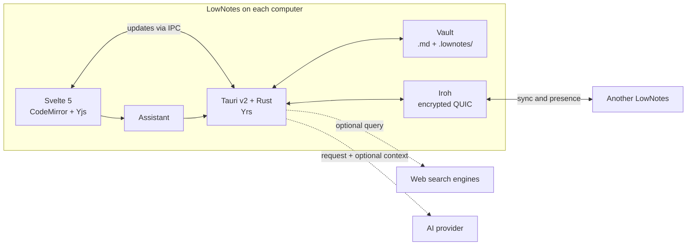

<p align="center">
  
</p>

<h1 align="center">LowNotes</h1>

<p align="center">
  Your Markdown notes, on your computer.<br>
  P2P collaborative editing whenever you want.
</p>

<p align="center">
  <a href="https://github.com/LowBloat/LowNotes/releases/latest">Download the app</a>
  · <a href="#get-started">Get started</a>
  · <a href="#how-it-works">How it works</a>
  · <a href="#development">Development</a>
</p>

---

LowNotes is a desktop editor for people who want **readable Markdown files**, a comfortable interface, and collaboration between devices without hosting a notes server. You can work with local files only; P2P pairing and the AI assistant are optional.

| Day to day | When you need more |
| --- | --- |
| Side-by-side Markdown editor and preview, with Mermaid diagrams | Real-time editing with CodeMirror, Yjs and Yrs |
| Folders, links between notes and a connection map | Encrypted P2P sync with Iroh |
| Megumin and Rimuru Tempest themes, plus custom palettes | Assistant with vault search, web search and Word/PDF export |
| `.md` notes that open in other editors | Conflict copies to review divergent offline edits |

## Get started

1. Download the Windows, Linux or macOS build from [Releases](https://github.com/LowBloat/LowNotes/releases/latest).
2. Open LowNotes and pick a folder for your **vault**. You can use a folder that already contains `.md` files.
3. Create a note or open an existing one. Switch between **Editor**, **Split** and **Preview**; split mode is the default.
4. To sync another computer, open **Manage Connections** in the sidebar and follow [P2P pairing](#p2p-pairing).
5. To use AI, pick a model under **Settings → Providers**. Ollama and LM Studio work locally when the service and model are installed; remote providers need their credentials.

When you close the window, the app stays in the system tray by default. Opening LowNotes again shows and focuses the existing window, restoring it if minimized. Only one instance runs at a time. You can change the close-to-tray behavior in **Settings → General**; the tray menu also lets you quit completely.

On Linux, updates follow the installation format. Arch, DEB and RPM packages show a new-version notice with a download for the matching package; install it through pacman, APT or your RPM package manager. Repository, AUR, Flatpak and Snap installations should be updated through their original source when the new version becomes available there. Portable `.tar.gz` installations require replacing the application files manually. Only unmanaged AppImages in a writable folder update inside LowNotes. Native packages never replace their executable with an AppImage.

## What the app offers

### Notes and organization

- Editable Markdown with preview, tasks, tables, footnotes, syntax extensions and Mermaid diagrams.
- Check or uncheck tasks directly in **Split** or **Preview** view. The matching `[ ]` / `[x]` marker is edited in the Markdown, autosaved and synchronized through the editor's collaborative history. Each toggle is a separate local undo step; code examples and checkboxes in assistant responses stay read-only.
- **Ctrl + click** a Markdown link, image URL or plain web URL in the editor to open it in your default browser (**Cmd + click** on macOS). Regular clicks continue to edit the note; local image references stay in the vault.
- **Ctrl + F** (**Cmd + F** on macOS) opens a floating finder in the upper-right corner of the note area. Editor mode searches Markdown, Preview mode searches rendered text, and Split mode searches both panes and scrolls them together when navigating results. Use Enter / Shift + Enter, F3 / Shift + F3 or Ctrl + G / Ctrl + Shift + G to move between matches; Esc closes the finder. Case, whole-word and regular-expression options are available, with Markdown replacement in Editor and Split modes.
- Paste an image anywhere in the text editor to save it and insert a Markdown reference. Choose **Local (default)**, Catbox or Imgur under **Settings → General → Pasted images**. The choice is saved per device; each paste keeps its provider during processing and retries. Progress and retry appear above the editor.
  - **Local:** works offline without accounts or application keys. Images are stored in a single hidden SQLite file, `.lownotes/images.sqlite3`, inside the vault. Static images are optimized with lossless WebP when smaller; GIF frames, timing, transparency and loop counts are preserved. Already smaller originals and animated PNG/WebP remain intact. Repeated content is deduplicated. Limits: 50 MB input (20 MB GIF), 32 megapixels, 16 MB stored per image. Markdown uses stable `lownotes-image:<content-hash>.<extension>` references, so moving or renaming notes does not break images. Preview and Word/PDF export resolve them locally. Copy the entire vault, including `.lownotes`, for a complete backup; these references require LowNotes to read the database.
  - **P2P images:** only missing immutable blobs are transferred and verified by content hash, rather than copying or syncing SQLite database files. Images created offline on different devices merge without overwriting one another. Both devices need this image-capable version; ordinary note sync remains compatible with older versions. Removing a note or undoing a paste retains its image blob so another note, undo or an offline peer can still reference it.
  - [Catbox](https://catbox.moe/): PNG, JPEG, GIF, WebP or BMP; 200 MB per image, 20 MB for GIFs. No account or key required. Its [FAQ](https://catbox.moe/faq.php) states that anonymous files expire after two years without access. LowNotes uses anonymous uploads.
  - [Imgur](https://apidocs.imgur.com/): PNG, JPEG or GIF; LowNotes uses a conservative 10 MB limit based on Imgur’s [legacy image API documentation](https://api.imgur.com/endpoints/image). Anonymous uploads use a public Client ID, never a Client Secret. Leave the optional Client ID empty to use LowNotes’ shared quota (approximately 1,250 uploads/day across users), or provide your own application ID. Imgur may compress or convert images. Anonymous deletion hashes are stored locally in `imgur-uploads.jsonl` beside the app settings, outside the synced vault.
- Interface zoom with **Ctrl + +**, **Ctrl + -** or **Ctrl + mouse wheel**; **Ctrl + 0** resets to 100%. The chosen level is saved on the device.
- **Ctrl + Z** undoes only your local note edits, preserving text from other devices; **Ctrl + Y** or **Ctrl + Shift + Z** redoes your edits.
- Immediate autosave with a stable **Saved** indicator while typing and a warning if saving fails.
- **History and trash** in the sidebar keeps recovery on this computer. Select an archived deletion to restore it after a restart, including folders, assets and collaborative history; an occupied filename gets an alternative name. Note versions follow their identity through moves. Compare a version or another note (including conflict copies) with the current Markdown, choose either text or combine/edit the result, then apply it as a new collaborative edit. If the note changed during comparison, refresh to review the new text while keeping your combined result.
- Local recovery data is kept forever by default. Under **History and trash → Retention**, optional day limits are checked at startup and every 15 minutes while the vault is active. A cleanup preview shows expired versions/archives and protected items before manual removal. Deletion archives awaiting acknowledgement from a paired device, external recovery files and unsafe/incomplete archives stay protected. The structural deletion history and immutable image blobs are retained.
- Long editor lines wrap visually by default, preserving the file's line breaks and numbering. Disable **Visual line wrapping** in **Settings → General** to use horizontal scrolling.
- Folders, note search, `[[links between notes]]` and local Markdown links. The link map combines relations written in notes with relations added manually or by the assistant.
- Export notes and drafts to Word (`.docx`) and PDF using the same Markdown dialect as the preview. Rich text, lists, tasks, aligned tables, links and footnotes are preserved; Mermaid diagrams and images are embedded as visuals. PDF text remains selectable and Word text remains editable. Images can come from the vault, HTTP(S) addresses or data URLs.
- Settings gathered on one screen: general preferences, themes, AI, providers, web search sources and app information.

### Optional assistant

The assistant can chat, query notes, create documents and plans, edit existing notes, or search the web. Drafts are available for review before **Save to vault**; this action never overwrites an existing note. Requested edits (including completing checklist items) show the original and replacement excerpts in the chat; **Apply to note** saves a targeted CRDT change and updates the open editor and paired devices. Each original excerpt must match exactly once, so changed or ambiguous passages require a new proposal. Open the relevant note and choose **Note** scope when its content is not included in vault search. Conversations, drafts, edit proposals and memory are stored **locally per vault**, even after you close the app.

Vault search selects snippets by words, phrases and headings **on your own computer**; it uses no vector database or external indexing service. When calling a remote model, the request and the selected snippets are sent to the chosen provider. In web search, only the query terms go to the search source; the selected model remains responsible for the answer.

Under **Settings → Web search**, Firecrawl, Keenable, Exa, DuckDuckGo and a public SearXNG instance come enabled without a key. The app rotates the initial source and tries the next one on failure. Brave and Parallel can be enabled with your own key; Firecrawl, Keenable and Exa also accept an optional key. Public services may enforce limits or change availability.

## How it works



| Layer | Responsibility | Code |
| --- | --- | --- |
| Interface | Editor, preview, sidebar, settings and assistant | `src/lib/components/`, `src/routes/` |
| Desktop bridge | Commands between the interface and the local process | `src/lib/api.ts`, `src-tauri/src/commands.rs` |
| Local data | Vault reading, links and preferences | `src-tauri/src/vault.rs`, `links.rs`, `config.rs` |
| Collaboration | CRDT history, P2P messages and reconciliation | `src-tauri/src/crdt.rs`, `network.rs` |
| Assistant | Skills, snippet selection, web search and history | `src-tauri/src/assistant.rs`, `rag.rs`, `web_search.rs`, `chat_history.rs` |

### Data and sync decisions

**Markdown stays a real file.** Notes live in the folder you chose and can be opened in other editors. The history needed for collaboration lives in `.lownotes/crdt/`; links added outside the text have an immutable add/remove history in `.lownotes/link-operations.json` and a readable projection in `.lownotes/links.json`. When backing up or moving a vault between computers, take the `.lownotes/` folder along with the `.md` files.

**Deletes and moves have stable identities.** The structural history in `.lownotes/catalog.json` records creation, movement, deletion and explicit restoration. Current peers merge and apply this catalog before comparing file manifests. A missing path is therefore distinguished from a deleted note, and an update to an old name follows the original identity through a move. Creating a note at a deleted filename gives it a new identity; a delayed update to the old note cannot edit the replacement. Concurrent edits to deleted notes are preserved as review copies. Device acknowledgements are retained with the operation history.

**Written references follow moves.** Renaming or moving notes and folders updates local Markdown destinations, reference definitions and wikilinks while retaining labels, aliases, titles, anchors and code examples. Relative links are recalculated from the moved source, including local assets. Bindings travel with the collaborative state and use stable note identities and text positions. Concurrent destination rewrites converge without duplicating URLs; reference maintenance is distinguished from user edits. The graph and preview resolve encoded paths, and web links in the preview open through the system browser. Both peers need the structural version for full offline move convergence.

**Removed data stays recoverable locally.** Structural transactions stage every affected source before placing destinations, preserving collaborative history and files inside moved folders. A restart completes pending transactions; divergent external files remain available for review. Removed files and their original collaborative states are retained in `.lownotes/trash/`, and undoing a deletion records an explicit restore. A durable `.lownotes/pending-catalog.json` queues structural application before the catalog is published, so recovery also covers interruption before filesystem staging begins. Files recreated externally during an interrupted move are preserved as review copies and complete local archives in `.lownotes/recovered-files/`. Restoration uses another filename when the original already belongs to a replacement note. These archives and `.lownotes/catalog-paths.json` describe local storage and are not exchanged as ordinary files. The catalog, active notes, link operations and immutable image blobs carry synchronization between devices.

**Map changes merge between devices.** Distinct manual or assistant links created offline survive reconciliation regardless of file timestamps. Removing a relation records the additions already seen, so receiving a stale list cannot bring them back. A genuinely concurrent new addition remains available; a later intentional re-add uses a fresh identity. The operation history retains the origin of every addition. Current peers also bind each addition to the stable identities of both endpoint notes: the visible map follows folder/note moves without changing the original addition payload. A deleted endpoint hides its relation; explicitly restoring that identity reveals it again. A replacement note at the old filename can receive a new, separate relation. Both devices need this operation-capable version for full map reconciliation; older versions can exchange ordinary notes, images when supported, and legacy link lists, but cannot express durable link removals or intentional re-adds after those removals.

**Live and offline edits follow different paths.** With two connected apps, editor changes are sent as CRDT updates and appear on the other device. With paired peers, a full reconciliation happens when the app opens; another periodic round recovers lost messages or disconnected periods.

**An offline divergence preserves both versions.** If both sides changed the same note without seeing the other's change, reconciliation keeps one full version in the original note and creates `name (conflict <hash>).md` with the other. The device that detects the conflict shows a notice with a shortcut to the copy. The choice of the main version is deterministic, **not a decision about which text is newer or better**; review both and merge whatever content you want. The copy is also synced to the other computer.

**P2P does not mean no connection infrastructure.** Notes do not live on a central LowNotes server. Iroh uses direct connections when possible and may fall back to discovery/relay infrastructure to establish or forward the encrypted connection.

**Optional data stays separate.** Preferences live in the app's local `settings.json`; provider keys and the private P2P identity use the operating system's credential store (Windows Credential Manager, macOS Keychain, or Secret Service on Linux). Existing installations migrate after each stored secret is read back successfully, preserving pairing and provider settings; legacy settings backups are scrubbed after migration. If the credential store is unavailable or locked, LowNotes keeps the existing data and shows a retry action in Settings. An unavailable migrated identity never generates a replacement identity. Linux needs a running, unlocked Secret Service implementation, such as GNOME Keyring or KWallet. Conversation history lives in the local data directory, separated per vault. These files and credentials are not part of the vault or the P2P sync.

**Interrupted saves can be recovered.** Local writes use atomic replacement and validated backups. A durable pending edit coordinates Markdown and its CRDT state; the next open or sync completes an interrupted save and reports the recovery. If an external editor changed the text after the interruption, its version is preserved as a conflict copy for review. Backups, pending saves and corrupt recovery copies stay outside the P2P manifest.

**Unlinking also edits collaborative text.** Removing a map relation unwraps matching Markdown links and wikilinks while retaining their labels. A local `.lownotes/pending-links.json` coordinates the immutable map operations and those text edits by note identity. Recovery resumes from the current Markdown, preserves external edits and reports a damaged intent instead of resetting it silently. Text and CRDT are committed together, and the open editor receives the updated state. Legacy Markdown packets use the same coordinated save; synchronization imports external Markdown changes into the collaborative state before comparing manifests.

**Creation is recoverable too.** Notes, folders and assistant drafts record a durable creation intent in `.lownotes/pending-create/` before publishing their catalog identity or content. New notes receive an independent collaborative seed, including empty notes. Recovery follows subsequent moves and observed deletions; deleted creations stay restorable in the ordinary local trash. If an external file occupies the filename during recovery, both contents are retained with independent identities. Native document saves and incoming synchronized content share the structural coordinator, so a save cannot recreate an old filename during a move.

**Versions are local checkpoints.** `.lownotes/versions/<note-id>/` stores immutable, hash-validated Markdown snapshots before edits. Ordinary typing is coalesced into one checkpoint per minute; explicit restore/merge actions also preserve the previous text. Restoration adds a new CRDT edit instead of rolling back the document state. History and trash are local to each device, excluded from the ordinary sync manifest, and included when copying the complete vault. Retention preferences live in `.lownotes/history-settings.json`; expiry never removes structural deletion operations or image blobs.

**Defaults evolve without replacing personal choices.** Built-in palettes, AI providers and search sources are defined by the app and merged with saved settings. This way, new defaults can arrive in an update without erasing keys, models and custom entries.

**Export loads when used.** The Word and PDF libraries are loaded on demand, not part of the initial editing path.

## P2P pairing

Use the same up-to-date version on both computers to get the complete sync behavior. The current sync protocol is `lownotes/sync/5`, with `/4` fallback for map operations, `/3` for notes/images and `/2` for ordinary notes. Only `/5` peers exchange structural identities and durable deletions; older clients can retain obsolete paths until updated. LowNotes preserves ambiguous legacy changes for review instead of using them to overwrite a new note at a reused filename. Pairing codes remain `LOWNOTES2_...`; their prefix does not identify the negotiated sync protocol.

1. Open LowNotes on both computers and select a vault on each.
2. On the first one, open **Manage Connections → Share Code** and copy the `LOWNOTES2_...` code.
3. On the second one, open **Connect Device**, paste the code and request pairing.
4. Accept the request on the first computer.

After that, edits to open notes can arrive in real time. Changes made while a device was disconnected are reconciled when the connection returns; you can also use **Sync now** in the sidebar.

## Development

### Requirements

- [Rust](https://rustup.rs/) with the stable toolchain
- [Bun](https://bun.sh/)
- System dependencies required by Tauri on your platform; on Linux, see the libraries installed in [`.github/workflows/release.yml`](.github/workflows/release.yml)

```bash
bun install
bun run tauri dev
```

To build the app:

```bash
bun run tauri build
```

To verify changes:

```bash
bun run check
bun test
cargo test --lib --manifest-path src-tauri/Cargo.toml
bun run build
bunx playwright install chromium
bun run test:e2e
```

The frontend uses **Svelte 5, TypeScript, Tailwind CSS v4, CodeMirror 6 and Yjs**. The backend uses **Tauri v2, Rust, Yrs and Iroh**. The Markdown renderer is based on `markdown-it` with extensions and Mermaid. Multi-platform publishing is done by the [release workflow](.github/workflows/release.yml), which generates installers, signatures and the updater's `latest.json`.

The [verification workflow](.github/workflows/ci.yml) runs on pushes and pull requests across Windows, Linux and macOS. Browser tests exercise the real frontend with an isolated native IPC adapter; Rust tests cover persistence, crash recovery, credentials and synchronization. Native credential-store tests use a synthetic entry that is deleted afterward; Linux CI creates an isolated Secret Service session.

## License

LowNotes is distributed under the **GNU Affero General Public License v3.0 (AGPL-3.0-only)**. See [LICENSE](LICENSE).
